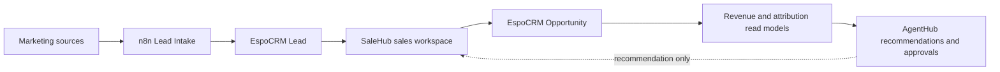

# Ngọc Phương Đông unified SaleHub–AgentHub full handoff

## Purpose and operating principle

This document hands over SaleHub and AgentHub as one coordinated digital operating
platform for Ngọc Phương Đông's real-estate brokerage business. “Unified” means shared
business identifiers, data contracts, operating controls and end-to-end workflows. It
does **not** mean combining repositories, containers or data ownership into one service.

The non-negotiable source-of-truth model is:

- EspoCRM owns customer, Lead and Opportunity records.
- WordPress/SaleHub owns the frontline sales experience and published sales content.
- AgentHub owns orchestration, read-only marketing intelligence, campaign/attribution
  models, reliability, approval/audit and recommendations.
- n8n remains the deterministic integration layer. AgentHub's production write executor
  remains disabled unless a later owner-gated phase explicitly changes that boundary.

## Platform boundaries

| Component | Primary responsibility | Must not become |
|---|---|---|
| SaleHub | Frontline sales workspace; inventory, pricing, sales policy, Lead/Opportunity interaction and authorized transaction steps | A replacement CRM or an ungoverned marketing executor |
| AgentHub | Marketing and campaign intelligence; attribution; provider health; approval/audit; recommendation layer | A parallel CRM/CMS or autonomous channel operator |
| EspoCRM | Canonical customer, Lead, Opportunity, activities, stages and won/lost value | A derived dashboard cache owned by AgentHub |
| WordPress | Public content and SaleHub web experience | A bulk-email provider or campaign ledger |
| n8n | Deterministic intake and explicitly approved integrations | A hidden autonomous decision maker |
| Caddy | Shared TLS and reverse proxy for the existing production stack | A second proxy instance created by either application team |
| Redis | Existing shared service with isolated logical databases/namespaces | A place to mix AgentHub state with Video Factory job keys |

## Unified business flow

1. Marketing sources propagate the tracking contract to n8n Lead Intake.
2. n8n validates and writes through the existing authorized intake workflow.
3. EspoCRM creates or updates the canonical Lead; identity and duplicate signals are
   retained.
4. SaleHub presents the Lead, project, inventory, current price/policy and authorized
   transaction actions to sales staff.
5. Sales activities advance the canonical Opportunity in EspoCRM, including its value
   and won/lost result under the granted CRM workflow.
6. AgentHub reads source data, computes campaign/attribution/reliability views and later
   journey/scoring recommendations.
7. Any future side effect returns through RBAC, approval, deterministic execution and
   audit. A recommendation never silently becomes a customer contact.

## Shared domain and tracking contracts

### Campaign and source identity

All downstream components should preserve, when available:

- `campaign_id` as the canonical NPD campaign identity;
- `utm_source`, `utm_medium`, `utm_campaign`, `utm_content`;
- `source_campaign_id`;
- `source_adset_id` or `source_ad_group_id`;
- `source_ad_id`;
- `landing_page`;
- first-touch and last-touch context.

An ad-platform name is descriptive metadata, not a substitute for a stable campaign ID.
Source IDs must be retained even when an operator uses project-neutral ad names.

### Customer and commercial identity

The cross-component join contract uses canonical CRM identifiers:

- `lead_id`;
- `opportunity_id`;
- project or project slug/reference;
- Opportunity stage and won/lost state;
- authoritative Opportunity amount and currency metadata;
- appointment/site-visit/negotiation evidence;
- source and campaign references;
- timestamps, owner and audit correlation identifiers.

Do not copy credentials into these objects. The approved default/new-business contract is
**VND only**: explicit non-VND data must fail closed and must never be silently relabeled
or converted. Historical USD records remain immutable audit evidence, not inputs to a new
mixed-currency executive total. The VND-only implementation is isolated in draft PR #33
and is not yet claimed as AgentHub 0.13.0 production behavior.

### Customer-journey contract

The next business phase may project these minimum states without taking a side effect:

`anonymous -> lead -> engaged -> MQL -> SQL -> appointment -> site_visit ->
negotiation -> won/lost -> customer -> reengagement`.

The projection must cite its evidence, retain the canonical CRM identity and never
overwrite the CRM stage merely because an analytical score changed.

## Production topology

### Public entry points

| Service | URL | Expected boundary |
|---|---|---|
| AgentHub Command Center | [mkt.ngocphuongdong.com/command-center](https://mkt.ngocphuongdong.com/command-center) | Google login and RBAC gate |
| AgentHub readiness | [mkt.ngocphuongdong.com/readyz](https://mkt.ngocphuongdong.com/readyz) | Health only; no secret or business payload |
| SaleHub | [ngocphuongdong.com/salehub/](https://ngocphuongdong.com/salehub/) | Frontline authenticated sales experience |
| n8n | [n8n.ngocphuongdong.com](https://n8n.ngocphuongdong.com) | Existing protected orchestration service |
| EspoCRM | [crm.ngocphuongdong.com](https://crm.ngocphuongdong.com) | Existing protected CRM |

### VPS and runtime layout

- VPS: `157.10.201.169`, administered through a project-scoped SSH key and known-hosts
  file with `StrictHostKeyChecking=yes`.
- Shared stack: Docker Compose project `n8n-marketing` at
  `/opt/n8n/docker-compose.yml`.
- Shared proxy: existing container `n8n-marketing-caddy-1` with host configuration
  `/opt/n8n/Caddyfile`. Never install or start a second Caddy.
- Existing stack includes n8n/Postgres, EspoCRM and its database/daemon/websocket,
  Caddy and the approved supporting integration services.
- AgentHub: Compose project `npd-agent-hub-prod`, bound only to
  `127.0.0.1:8010` on the host and exposed publicly through the existing Caddy.
- AgentHub joins the existing `npd-ai-video-factory_default` and
  `n8n-marketing_n8n_net` networks. The Caddy-side alias is `npd-agent-hub`.
- SaleHub static releases are under `/opt/salehub/releases`; production switches through
  the atomic `/opt/salehub/current` symlink.

### Persistence ownership

| Data | Location/contract | Ownership rule |
|---|---|---|
| Video Factory jobs | Redis DB 0, `npd:video-jobs:*` | Video Factory only |
| AgentHub state | Redis DB 1, `npd:agent-hub:v1:*` | AgentHub only; backup/restore by namespace |
| Customers and Opportunities | EspoCRM database/API | EspoCRM canonical source |
| SaleHub release artifacts | `/opt/salehub/releases` plus `current` symlink | SaleHub deployment owner |
| AgentHub deployment evidence | `/var/lib/npd-ai/agent-hub-deployments` | Immutable deployment/audit evidence |
| AgentHub backups | `/var/backups/npd-agent-hub` | Namespace-scoped recovery evidence |

Redis restoration is never automatic. A normal application rollback should restore the
previous image/config first and only restore Redis after an explicit data-loss decision.

## Identity, RBAC and approval boundaries

### Human roles

| Role | Allowed use |
|---|---|
| Viewer | Inspect dashboards, campaigns, attribution, provider health and audit-safe previews |
| Operator | Create/update draft-safe plans and request approval; no owner-only side effect |
| Owner | Approve/reject governed actions and accept production/business milestones |

Google login establishes browser identity. Server-side RBAC, not hidden UI controls,
enforces the role. Audit records must contain safe actor/correlation metadata, not tokens
or secret material.

### Capability matrix

| Capability | Live | Preview-only | Disabled | Owner-gated |
|---|:---:|:---:|:---:|:---:|
| Read CRM, Meta Ads, GA4, Social and Lead Intake health | Yes |  |  |  |
| Campaign planning and tracking validation | Yes | Draft/preview output |  | Approval for later side effects |
| Attribution, revenue and provider-health analysis | Yes |  |  |  |
| Alert routing to email/PWA/Zalo/ticket |  | Yes | External delivery | Provider onboarding and a later release |
| Experiment planning |  | Yes | Autonomous execution | Any controlled execution |
| Ads launch/budget mutation |  |  | Yes | Future Controlled Channel Execution phase |
| CRM mass write/customer contact |  |  | Yes | Separate minimum-scope workflow approval |
| Bulk Email/Zalo/ZBS |  |  | Yes | Dedicated compliant provider and consent controls |
| WordPress production landing publish |  | Preview/staging contract | Yes | Explicit production publish approval |
| n8n Agent write executor |  |  | Yes; webhook blank | Future signed, scoped executor design |

The internal Video Factory job flow is an existing bounded capability and does not grant
AgentHub permission to mutate marketing, CRM, messaging or CMS systems.

## Credential contract

Secret values are not part of this handoff. Production credentials stay in protected host
files with least privilege and are never stored in Redis, campaign/task/audit objects,
logs, issues or Git.

| Concern | Contract names/location | Minimum privilege |
|---|---|---|
| Browser/RBAC | `AGENT_VIEWER_TOKEN`, `AGENT_OPERATOR_TOKEN`, `AGENT_OWNER_TOKEN` and the configured browser OIDC variables | Identity and role evaluation only |
| EspoCRM | `ESPOCRM_URL`, `ESPOCRM_API_KEY` | Read-only for AgentHub |
| Meta Ads | `META_ADS_ACCOUNT_ID`, `META_ADS_ACCESS_TOKEN`, `META_GRAPH_VERSION` | `ads_read`; no mutation |
| GA4 | `GA4_PROPERTY_ID`, `GA4_SERVICE_ACCOUNT_FILE`, `GA4_SERVICE_ACCOUNT_HOST_FILE` | Property read-only; secret file mounted read-only |
| Social Page | `SOCIAL_META_PAGE_ID`, `SOCIAL_META_ACCESS_TOKEN`, `SOCIAL_META_GRAPH_VERSION` | Long-lived page aggregate read; no publish permission used |
| Redis | `AGENT_REDIS_URL`, `AGENT_STORE_NAMESPACE` | DB 1 and AgentHub namespace only |
| Receipt signing | Active HMAC key ID/key and historical verification-key file variables described in [the rotation runbook](./HMAC_RECEIPT_KEY_ROTATION.md) | Active key signs; historical keys verify only |
| n8n executor | `N8N_AGENT_EXECUTOR_WEBHOOK_URL` | Must remain blank/disabled in the accepted baseline |

Host contract:

- `/etc/npd-ai/agent-hub.env`, mode `0600`;
- GA4 service-account file under `/etc/npd-ai`, mounted read-only into the container;
- historical HMAC verification-key file under `/etc/npd-ai`, mounted read-only;
- local SSH key `work/n8n-vps/codex_n8n_vps_ed25519` and project-scoped
  `work/n8n-vps/known_hosts_test`; never copy their contents into chat or Git.

Current production receipt-signing state after the owner-gated 2026-08-26 drill:

- active signing generation: `npd-attribution-v2`;
- historical verify-only generation retained: `npd-attribution-v1`;
- historical verification file:
  `/etc/npd-ai/agent-attribution-verification-keys.json`, mounted read-only;
- old v1 delivery and heartbeat receipts plus a new v2 heartbeat were all verified;
- no key value is stored in Redis, Git, issue comments or this handoff.

## Deployment procedure

### AgentHub guarded deploy

Follow [Phase 5 Production Deployment](./PHASE_5_PRODUCTION_DEPLOYMENT.md):

1. confirm owner gate, target SHA and change scope;
2. run preflight with strict host-key checking;
3. capture the AgentHub namespace backup and rollback image before replacement;
4. deploy only the `npd-agent-hub-prod` service and preserve the two existing networks;
5. run local readiness/RBAC/provider/safety smoke;
6. back up `/opt/n8n/Caddyfile` before any necessary route edit;
7. validate and reload the existing Caddy **inside** `n8n-marketing-caddy-1`;
8. run public HTTPS/auth/provider smoke;
9. store the deployment receipt and begin the owner-defined observation window.

Do not create a second n8n, Caddy or Redis service.

### SaleHub release promotion

1. coordinate the maintenance window with the AgentHub/shared-infrastructure owner;
2. build a new immutable directory under `/opt/salehub/releases`;
3. validate the release and any WordPress/API dependency before promotion;
4. back up Caddy if its routes or mounts must change;
5. switch `/opt/salehub/current` atomically;
6. validate the existing Caddy configuration and avoid unrelated reload/recreation;
7. test representative SaleHub workflows, not only the homepage;
8. run the cross-system smoke for SaleHub, AgentHub, n8n and CRM;
9. record the release, actor/scope, timestamps and rollback target.

For `releases/20260826-position-image-autosync-v1`, shared-route health and representative
business acceptance passed. Browser QA confirmed 4/4 current Vinhomes Saigon Park cards
used first-party versioned images matching their unit codes, and the `TL12-37` modal
rendered the matching position image. The timer-backed index reported 104 images across
four projects with zero warnings and readonly Drive authentication. Exact unit-code
matching remains mandatory; never infer a nearby image for a missing current code.

The VPS-to-WordPress pricing-sync writer also completed one authorized, non-retried run:
the last-result envelope reported `ok=true`, no 403/500 response, four updated projects
and a valid public VSP pricing contract. Issue #28 is closed. The owner chose to retain
the hosting provider's current WAF exception rather than narrow it in this milestone;
this is an explicit accepted boundary, not evidence that the exception is route-scoped.

## Backup and rollback

### Accepted AgentHub 0.13.0 artifacts

- Receipt: `/var/lib/npd-ai/agent-hub-deployments/deploy-20260825T050536Z.json`.
- Backup: `/var/backups/npd-agent-hub/agent-hub-20260825T050536Z.json`.
- Image: `npd-agent-hub:rollback-20260825T050536Z`.
- Stable tag: `agent-hub-v0.13.0` ->
  `400899ba82501beeea469f4a33dc169a9a09bb8e`.
- HMAC drill Redis backup:
  `/var/backups/npd-agent-hub/hmac-rotation-20260826T100000Z/agent-hub-before-rotation.json`.
- HMAC drill configuration backup:
  `/var/backups/npd-agent-hub/hmac-rotation-20260826T100000Z/config/agent-hub.env-20260826T095854Z`.
- Post-rotation receipt:
  `/var/lib/npd-ai/agent-hub-deployments/deploy-20260826T095855Z.json`.
- Post-rotation rollback image: `npd-agent-hub:rollback-20260826T095855Z`.
- SEO publisher backup:
  `/var/backups/npd-content-publisher/seo-json-retry-20260826T102459Z`; rollback image
  `n8n-marketing-content-publisher:rollback-20260826T102459Z`.

Rollback sequence: confirm exact target, preserve the incident evidence, restore the
previous image/config, run local and public smoke, and leave Redis untouched unless an
explicitly diagnosed data problem requires a manual namespace restore.

SaleHub rollback switches the `current` symlink to the verified previous release and then
repeats representative business and cross-system smoke. AgentHub monitoring must not
roll back SaleHub automatically.

## Smoke and monitoring contract

### After any shared-stack change

- AgentHub `/readyz` returns 200 and OpenAPI reports the expected version.
- `/command-center` remains login-gated.
- AgentHub receipt SHA, image and version match the approved target.
- AgentHub is healthy with no new restart/fatal exception.
- Scheduler progresses, lag is within SLO, lease skips do not increase and last error is
  empty.
- Redis DB 1 namespace metadata is present and receipts verify.
- CRM, Meta Ads, GA4, Social and n8n Lead Intake remain read-only and healthy.
- n8n, Postgres, Caddy, Video API, worker and renderer remain healthy.
- Caddy configuration validates and the AgentHub, n8n, CRM and SaleHub routes pass TLS.
- `N8N_AGENT_EXECUTOR_WEBHOOK_URL` is blank; external notification and production-write
  flags remain false.

Lead activity and producer liveness are different metrics. A period with no new real
lead is not itself a failed intake heartbeat; a fake customer must not be created merely
to make the activity counter move.

### Accepted 24-hour AgentHub baseline

The fixed window `2026-08-25T05:11:00Z`–`2026-08-26T05:11:00Z` passed with 288 of
288 scheduled heartbeats, no gap above 330 seconds, zero lease skips, zero overlapping
incidents, five healthy providers, valid latest delivery/heartbeat receipts, persistent
Redis state and zero AgentHub restarts. See the
[work summary](./NPD_UNIFIED_SALEHUB_AGENTHUB_WORK_SUMMARY.md) for the evidence table.

### Accepted natural SEO schedule follow-up

The bounded structured-output retry is now accepted on the natural schedule as well as
the direct dry-run. The active n8n workflow kept cron `0 8,10,12,14 * * *` and
`content-publisher` received all four expected calls on both 2026-08-27 and 2026-08-28.
All eight returned HTTP 200. Durable publisher state recorded `ok=true`,
`last_error=null` and WordPress post IDs `28068` through `28082` on the applicable even
IDs; WordPress REST independently returned `status=publish` and non-zero featured-media
IDs for every post.

Successful n8n executions are intentionally not persisted because production is set to
`EXECUTIONS_DATA_SAVE_ON_SUCCESS=none`. Evidence therefore correlates the registered
schedule and startup activation log, timestamped `POST /run` access log, durable
`/data/content-state.json` entries and live WordPress REST/public HTTPS results. No
workflow or production configuration was changed for this read-only acceptance. This
existing SEO writer remains separate from AgentHub, whose WordPress landing-page publish
and other customer/marketing write capabilities remain disabled.

## Incident response and change coordination

1. Freeze new feature work when production evidence becomes ambiguous.
2. Record UTC and local timestamp, component, actor/scope, deployment/release and exact
   symptom.
3. Separate SaleHub business data/content changes from AgentHub reliability signals.
4. Check shared-route impact before assigning causality to a Caddy recreation.
5. Preserve logs, receipts, backups and old release evidence; do not delete or rewrite
   the timeline.
6. Do not self-remediate, rotate HMAC keys, restore Redis, deploy or enable a write
   capability without its explicit gate.
7. If a fix changes runtime semantics, define a new observation window rather than
   extending the old result by assumption.

### RACI and shared-change rules

| Activity | Responsible | Accountable/approval | Consulted |
|---|---|---|---|
| SaleHub inventory/policy/UI release | SaleHub maintainer | Business owner | CRM and AgentHub owners when contracts/routes change |
| AgentHub code/release | AgentHub maintainer | Business/production owner | SaleHub owner for shared contracts |
| EspoCRM schema or write workflow | CRM maintainer | Data/process owner | SaleHub and AgentHub maintainers |
| n8n Lead Intake | n8n maintainer | Data/process owner | CRM and AgentHub maintainers |
| Caddyfile or container change | One designated shared-infrastructure operator | Production owner | All affected component owners |
| HMAC rotation or Redis restore | AgentHub reliability maintainer | Production owner | Security/operations |

Before touching Caddy or a SaleHub production symlink, announce a bounded maintenance
window. Only one actor owns the shared change at a time. Others monitor read-only and do
not overwrite, reload or roll back the active actor's work. At completion, capture the
final Caddy `StartedAt`/configuration digest, SaleHub symlink and cross-system smoke.

## Known risks and do-not-run guidance

- The SaleHub position-image auto-sync release passed representative visual acceptance;
  HTTP 200 alone must still never be used as future image-correctness evidence.
- Historical Green City/VSP position-image mappings may be incomplete or tied to an old
  release. Validate project/unit identity before reuse.
- The WordPress pricing writer passed one authorized VPS run and issue #28 is closed.
  The owner accepted the hosting provider's existing WAF exception scope and explicitly
  skipped further rule narrowing. Do not describe the rule as route-scoped. Continue to
  treat unexpected callers or a changed public contract as a security incident; do not
  disable Imunify360 globally.
- Historical one-off VSP policy migration, staging and correction scripts are audit
  evidence. **Do not rerun them against current production.** Clean-port required logic
  into a reviewed release instead. Do not delete the old evidence.
- The old VSP release `releases/20260825-vsp-policy-v07-v01` is a rollback/audit artifact,
  not the current application source of truth after the position-image release.
- New business contracts are VND-only. Reject explicit non-VND input rather than
  relabeling or performing an implicit conversion; retain historical USD as audit-only.
- The SEO workflow had repeated structured-output failures. `content-publisher` now has
  fence-tolerant parsing and one bounded retry, passed a real no-publish dry-run and then
  passed eight natural scheduled publications on 2026-08-27 and 2026-08-28. An active
  workflow or HTTP 200 alone is still not health proof; retain the correlated durable
  publisher-state and WordPress-contract evidence in future reviews.
- `new.ngocphuongdong.com` is not assumed to be an independent safe staging boundary.
- Legacy Video Factory PRs #8/#6 were closed without merge after clean replacements #34
  and #35 were created in that order. Human Vietnamese voice listening remains required.
- God-file extraction continues in separate draft PRs #30–#32 while preserving API
  responses, Redis keys and production behavior.

## Unified roadmap

### Completed foundation

- Phases 1–5: Video Factory, Agent Hub and production foundation.
- Phase 6A: read-only marketing intelligence.
- Phase 6B: Campaign Operating System.
- Phase 7: Attribution & Revenue OS.
- Phase 8A: Experiment & Optimization OS, preview-only.
- Phase 8B: reliability track 8.4–8.9.

### Next — Phase 9 Customer Journey & Sales Intelligence

1. read-only Customer Journey Projection;
2. deterministic and explainable Lead Scoring using source, campaign, recency,
   engagement, website activity, sales activity, project/budget fit, stage,
   appointment/site visit and data-quality signals;
3. recommendation-only Next Best Action with action, reason, priority, SLA, channel,
   project/campaign context, evidence and confidence.

Next Best Action must remain a recommendation. It must not contact a customer.

### Later owner-gated tracks

- Phase 10: controlled Meta/Google Ads, Email, Zalo/ZBS and landing-page execution.
- Phase 11: controlled creative experiments and landing-page CRO.
- Phase 12: executive revenue control tower, daily brief and AI/API cost governance.

Execution must not be opened before the journey, attribution and data-quality baselines
have been accepted and each target provider has a least-privilege, audited contract.

## Handoff checklist

- [x] AgentHub 0.13.0 acceptance PASS.
- [x] GitHub `main`, deployment receipt and runtime SHA equivalent.
- [x] Required CI successful on the exact revision.
- [x] Backups and rollback image retained.
- [x] Marketing/customer production writes remain disabled.
- [x] SaleHub concurrent maintenance separated from AgentHub incidents.
- [x] Representative SaleHub position-image auto-sync behavior accepted on live VSP data.
- [x] Unified documentation delivered through PR #26 with required checks enforced.
- [x] Stable `agent-hub-v0.13.0` tag created on the exact production runtime commit.
- [x] One authorized pricing-sync run succeeded; issue #28 closed under the owner's
  accepted WAF scope decision.
- [x] HMAC rotation drill completed with active v2, verify-only v1 and dual-generation
  receipt verification.
- [x] Separate refactor PRs #30–#32 and VND-only PR #33 prepared with green checks.
- [x] Legacy PR #8 then #6 clean-ported to #34/#35 and closed without merge.
- [x] Issue #7 closed as not planned under the unified NPD roadmap.
- [x] Record natural SEO workflow executions after the bounded retry fix; eight scheduled
  publications across 2026-08-27 and 2026-08-28 passed the downstream contract.
- [x] Owner rejected production-pilot V2 on 2026-08-29 because “Ngọc” still sounded like
  “nọc”; V2 remains preserved and must not be represented as accepted.
- [x] A separate V3 owner-review render was created with OpenAI `gpt-4o-mini-tts` voice
  `nova`, a female 25–30/soft/warm/professional instruction profile, and the synchronized
  CTA “Liên hệ với Ngọc Phương Đông để đặt lịch xem mô hình dự án.” Technical QC passed:
  30.059 seconds, 1080x1920, H.264/AAC, no black interval, audio in all six scenes,
  -18.42 LUFS, and exact “Ngọc Phương Đông” recognition by both `gpt-4o-transcribe` and
  `whisper-1` from the muxed MP4. Video SHA-256 is
  `9add7bf1b94b1d0a34eddb3a3acd6392d627c4342a3e67c14251f268094bddaf`.
- [ ] Owner listens to and accepts/rejects V3; keep issue #5 open until that explicit
  decision. Automated pronunciation/QC evidence does not accept timbre on the owner's
  behalf.
- [ ] Start Phase 9 only after the remaining PR-review and owner-voice gates above are
  explicitly dispositioned; no channel execution is implied.
