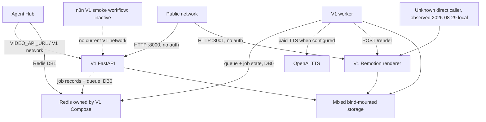

# Video Factory V1 dependency audit

## Decision

AH-01 is complete as a read-only audit. **V1 shutdown and deletion are NO-GO.**

The machine-readable inventory contains eight `UNKNOWN` components. Most importantly, the V1
renderer processed an unattributed direct request on `2026-08-29` local time, after the V1 API and
worker had been idle since `2026-08-14`. The shared storage root also contains recently updated
`owner-review-v3-*` material, and Agent Hub Redis DB1 is hosted by the Redis container owned by the
V1 Compose project.

No production service, route, queue, key, file, secret, Caddy configuration, n8n workflow, PR,
provider, or traffic path was changed by this audit.

## Non-negotiable boundary

- Agent Hub remains the business and automation control plane.
- Video Factory V2/V3 remains the independent media execution plane.
- Agent Hub may use only documented, versioned REST and signed webhook contracts.
- No V2/V3 repository modification, deployment, provider call, database access, secret access,
  acceptance-gate change, internal package import, shared database, shared Redis, or process-memory
  coupling is part of AH-01.
- V1 destructive work is prohibited while any inventory decision is `UNKNOWN`.
- Merge, deploy, traffic switch, write blocking, service stop, route change, archive expiry, and
  deletion remain separate owner gates.

## Evidence scope

| Item | Observed value |
|---|---|
| Audit window | `2026-08-29T09:49:35+07:00`–`2026-08-29T10:04:30+07:00` |
| Agent Hub/V1 repository | `vangnguyen/npd-ai-video-factory` |
| Audited source revision | `02c31be4729bf19f150791ee623dfb25d957ada7` (`origin/main`) |
| Production checkout | `/opt/npd-ai-video-factory` at `ca535a6a4cea67beeb0cae97b8fb5ea3c6c1743c` |
| Checkout drift | Production checkout is an ancestor of `origin/main`, 33 commits behind |
| V2/V3 repository | `vangnguyen/npd-video-factory-v2`; documentation read only |
| V2 documentation revision | `8fa96409b0db6ec6d4dc3c04f6e3aaab2f3201ee` |
| Production method | Docker/Redis/PostgreSQL/filesystem/log/network/config inspection, read only |

Secret values were neither read nor recorded. Container environment inspection was restricted to
safe configuration values and booleans indicating whether named secret variables were present.
No V1 job was created and no paid provider was called.

## Current dependency topology

This topology means `docker compose down`, Redis removal, storage cleanup, or renderer stop is not
a scoped V1-only action.

## Key findings

| ID | Finding | Consequence |
|---|---|---|
| F-01 | V1 API, worker, renderer, and Redis containers are running. | V1 is deployed, not merely dead source. |
| F-02 | Queue and processing lists are empty; 12 historical jobs remain in DB0. | Drain appears empty only at the dated snapshot; metadata still requires retention. |
| F-03 | Agent Hub is configured to call V1 directly, but DB1 contains zero `video.jobs.create` executions. | The dependency is enabled and callable even though recorded use is absent. |
| F-04 | Agent Hub `video.jobs.create` is a write tool that does not require approval. | AH-03 must add a policy boundary before any replacement or deprecation traffic. |
| F-05 | V1 POST/status/artifact routes and renderer routes have no authentication. | Public port exposure creates cost, compute, and data-access risk. |
| F-06 | Ports 8000 and 3001 bind to all interfaces and were reachable from the audit client. | Exposure bypasses Caddy; no Caddy route needs removal. |
| F-07 | Renderer handled an unknown direct job from `17:42:07Z` to `17:44:48Z` on 28/08. | Renderer cannot be stopped until the caller is identified and migrated. |
| F-08 | Storage contains V1 data and four recently updated `owner-review-v3-*` directories. | Whole-root archive/delete/move is prohibited. |
| F-09 | Agent Hub DB1 lives in the Redis service owned by V1 Compose. | Redis must be rehomed/split before V1 Compose can be stopped. |
| F-10 | Running V1 images have no git revision label or registry digest. | Exact rollback cannot be reproduced from the checkout without first exporting the images. |
| F-11 | API and worker were built from different source snapshots; worker/renderer match the old production-pilot branch. | Current checkout is not a reliable runtime source of truth. |
| F-12 | The only production n8n V1 workflow is inactive, manual, network-disconnected, and has zero retained executions. | It can be archived/deprecated later; it is not evidence that all V1 callers are absent. |
| F-13 | V1 uses Redis, not PostgreSQL. No production table name containing `video` was found. | Do not mutate n8n PostgreSQL as part of V1 job-data handling. |
| F-14 | AOF persistence exists, but no independent, restore-tested V1 DB0 + storage backup set was found. | AH-04 cannot begin until backup/restore evidence is produced. |
| F-15 | V2's documented bridge is authenticated and isolated but currently draft-only. | It cannot yet replace V1 render/approval/publish behavior through the bridge. |

## Repository inventory

The canonical component-level decisions are in
[`v1-components.json`](v1-components.json). The source search covered the required directories and
all tracked V1 concepts.

| Area | V1 contents | Primary decision |
|---|---|---|
| `apps/api` | FastAPI create/status/artifact routes, Redis store, manifest/assets/providers | `DEPRECATE` / `REPLACE_WITH_V2_API` / `MIGRATE` |
| `services/worker` | Queue recovery, script/storyboard, TTS, subtitles, render, QC | `DEPRECATE` |
| `renderer` | Remotion render service and static `/media` path | `UNKNOWN` until caller attribution; public media route target `DISABLE` |
| `packages/contracts` | V1 manifest schema | `KEEP` as historical read/restore contract |
| `examples` | V1 request and manifest fixtures | `DELETE_LATER` after rollback window |
| `services/agent_hub` | Video Producer, V1 create adapter, URL config, tests/evals, dashboard prompts | Keep business planning; replace adapter/config; migrate tests |
| `workflows/n8n` | Inactive Sprint 1 manual smoke | `DEPRECATE` |
| `docker-compose.yml` | Redis/API/Agent Hub/worker/renderer development topology | `MIGRATE`; split ownership before removal |
| `deploy/phase5` | Production Agent Hub joins V1 network and DB1 Redis | `MIGRATE` |
| `.github` and `scripts/e2e-smoke.sh` | Required V1 CI and Docker E2E | `MIGRATE` gradually; keep through rollback window |
| `docs` and root README | V1-first architecture, API and handoff material | Mark legacy, archive, `DELETE_LATER` |

Searches also covered `render`, `media`, `storyboard`, `TTS`, `subtitle`, `Remotion`, `FFmpeg`,
`video job`, `worker`, `manifest`, `generation`, `publish`, and `analytics`. No V1 video publishing
or analytics implementation exists in the V1 job schema. That absence does not prove there are no
external references to its artifacts.

## Production services and consumers

| Producer/consumer | Evidence | Classification |
|---|---|---|
| Agent Hub | Deployed with `VIDEO_API_URL=http://api:8000`; `video.jobs.create` enabled | Active potential consumer; zero recorded executions |
| V1 API | Four logged create requests after its current container start; last on 14/08 | Deployed, idle since 14/08 |
| V1 worker | One claimed/completed job after its current container start; queue now empty | Deployed, idle since 14/08 |
| V1 renderer | Direct render on 29/08 local time for a job absent from DB0 | Active consumer is `UNKNOWN` |
| n8n | One manual workflow, `active=false`, `triggerCount=0`, zero execution rows | Inactive/obsolete candidate |
| Cron/systemd | No matching cron, unit, or timer | None at snapshot; recheck before disable |
| Public network | Direct ports respond; unauthenticated writes exist | Potential consumer and security risk |
| Caddy | No V1 route; Agent Hub route only | Keep V1 absent from Caddy |
| External CMS/social references | Not represented by V1, not fully enumerated | `UNKNOWN` |

## V1 route classification

No route state was changed. Target state means the intended future direction, not authority to act.

| Route | Current | Target | Blocker |
|---|---|---|---|
| `GET /healthz` | `ACTIVE` | `DELETE_LATER` | Migrate monitoring; complete observation |
| `GET /readyz` | `ACTIVE` | `DELETE_LATER` | Migrate monitoring; preserve rollback |
| `POST /api/v1/video-jobs` | `ACTIVE` | `PROXY_TO_V2` | Current V2 bridge is draft-only; approval/deprecation policy missing |
| `GET /api/v1/video-jobs/{job_id}` | `ACTIVE` | `PROXY_TO_V2` | Preserve legacy ID reads; bridge status mapping required |
| `GET /api/v1/video-jobs/{job_id}/artifacts/{name}` | `ACTIVE` | `DEPRECATED` | External references and retention are unresolved |
| `GET /healthz` on renderer | `ACTIVE` | `DELETE_LATER` | Unknown renderer caller |
| `POST /render` | `ACTIVE` | `DISABLED` | Confirmed recent unattributed use |
| `GET /media/*` | `ACTIVE` | `DISABLED` | Unknown renderer caller and mixed storage ownership |

The compatibility target does not authorize Agent Hub to call V2's non-bridge interactive API.
Only an accepted, signed bridge contract can become the replacement.

## Jobs, queues, and data ownership

| Dataset | Snapshot | Owner | Required action |
|---|---:|---|---|
| Redis DB0 job records | 12: 7 `awaiting_review`, 5 `failed` | V1 | Export/checksum/archive; retain audit metadata |
| Redis queue | 0 | V1 | Recheck at every gate; preserve ordered evidence |
| Redis processing list | 0 | V1 | Recheck; reconcile state before rollback restart |
| Redis idempotency keys | 0 | V1 | No migration needed after export evidence |
| Redis DB1 Agent Hub namespace | 6,352 keys | Agent Hub | Back up/restore-test and rehome before V1 Redis stop |
| `storage/jobs` | 12 dirs, 98 files, 168,719,888 bytes | V1 | Archive; do not copy automatically to V2 |
| `storage/assets` | 8 files, 8,496,188 bytes | Legacy/project owner | Rights/business inventory before selective migration |
| `storage/owner-review-v3-*` | 4 dirs, 88 files, 35,149,286 bytes | Not established by AH-01 | Do not touch; V2/V3 boundary protected |
| `production-pilot-artifacts` | 45 files, 38,408,292 bytes | V1 acceptance evidence | Archive/checksum; deduplicate only after proof |
| `.runtime` | 17 files, 9,145,104 bytes | V1 operations; includes protected env backup | Separate secret-safe archival |
| Docker Redis volume | AOF enabled; mixed DB0/DB1 | Mixed | Persistence is not an independent backup |

There are no V1 PostgreSQL job tables. n8n PostgreSQL contains the inactive workflow definition
and no retained execution row for it.

## Security and operational boundaries

1. Source inspection shows no authentication dependency on V1 create/status/artifact or renderer
   routes. AH-01 deliberately did not submit a test write.
2. The V1 root `.env` is passed to API, worker, and renderer. Presence-only inspection confirmed an
   OpenAI key in all three, although only the worker needs TTS execution.
3. Renderer `/media` serves the whole storage root when a path is known. It therefore spans V1
   artifacts and recently created owner-review material.
4. Caddy does not front these ports; direct host bindings bypass the authenticated Agent Hub route.
5. The current logs do not include renderer caller identity, so the recent request cannot be
   safely attributed.
6. Runtime images are local `:latest` builds with no registry digest or git revision label. Exact
   image export is a prerequisite for reversible shutdown work.

These are recorded as risks, not silently remediated in an audit PR. Network containment is urgent
but still requires an explicit production change authorization because the renderer has a current
unknown consumer.

## V2/V3 replacement boundary

The V2/V3 repository was not modified. Only its public documentation at revision `8fa9640` was
read to establish the external contract:

- bridge base: `/api/v1/bridge`;
- contract version: `agent-hub-bridge.v1`;
- dedicated service identity and HMAC-SHA256 request signing;
- timestamp, nonce, body hash, replay protection and required idempotency for POST;
- durable signed webhooks to `/agent-hub/events/v1`;
- current inbound action: `project.create_draft` only;
- current emitted event: `video.project.created` only;
- render, publish, external action and pipeline start are explicitly false for the current bridge
  request.

Therefore AH-02 may build a mocked `VideoFactoryClient` against the documented bridge, but AH-03
cannot proxy V1 create/render semantics until an accepted versioned bridge capability actually
exists. The non-bridge V2 API is not an authorized shortcut.

## Open `UNKNOWN` components

| Component | What must be proven |
|---|---|
| `v1-renderer-service` | Identity and owner of the direct 29/08 local-time render caller |
| `v1-render-route` | Replacement path and zero-use evidence after caller migration |
| `mixed-storage-root` | Directory/file ownership, especially all `owner-review-v3-*` material |
| `v1-backup-restore-coverage` | Independent DB0/storage/image backup and a successful restore drill |
| `v1-publication-reference-catalog` | Authorized CMS/social/internal link inventory for V1 artifacts |
| `v1-image-provenance` | Exported, checksummed rollback images and source-hash manifest |
| `v1-open-pr34` | Owner decision to retain, close, or selectively archive QC work |
| `v1-open-pr35` | Owner decision separate from V2/V3 and human voice acceptance gates |

Any one of these is sufficient to block destructive work.

## Git and PR state

- `origin/main` is the audit base.
- Production V1 checkout is 33 commits behind `origin/main`, but the running images were built
  earlier and do not all match either checkout.
- Draft PR #34 is mergeable with seven green checks and modifies the V1 media engine.
- Draft PR #35 is stacked on #34, mergeable with three green checks, and modifies V1 TTS/pilot
  behavior.
- Draft PR #36 is documentation-only and separate from AH-01.
- AH-01 does not merge, retarget, close, or edit any of these PRs.

## Owner-gated next steps

1. Review and merge AH-01 only if the audit evidence and classifications are accepted.
2. Resolve the direct renderer caller and mixed storage ownership.
3. Decide PR #34/#35 disposition without changing V2/V3 provider or acceptance gates.
4. Produce restore-tested V1 DB0, storage, protected config and exact-image backups.
5. Rehome Agent Hub DB1/Redis ownership.
6. Implement AH-02 against `agent-hub-bridge.v1` with mocks and contract tests only.
7. Seek a new owner gate for AH-03 deprecation behavior and production deployment.
8. Start a 14-day observation only after deprecation telemetry and write blocking are deployed.

See [SHUTDOWN_PLAN.md](SHUTDOWN_PLAN.md), [ROLLBACK.md](ROLLBACK.md), and
[RISK_REGISTER.md](RISK_REGISTER.md) for the future gated procedure.
